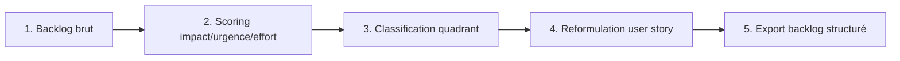

# Playbook : Backlog Triage Express

> Guide opératoire structuré en 4 volets (Définitions / Process / Documentation / Templates),
> pour comprendre, réutiliser ou transposer ce projet à un contexte réel.
> Rappel : projet personnel (PoC), voir [`README.md`](README.md).
> **Dernière mise à jour** : 23/08/2026

---

## 1. Définitions

| Terme | Définition |
|---|---|
| **Grille impact/effort/urgence** | Méthode de priorisation à 3 axes : la valeur produite (impact), le coût de réalisation (effort), la pression temporelle (urgence) |
| **Quadrant** | Classement croisé impact × effort en 4 cases (Quick win, Big bet, Fill-in, Time sink), issu de la matrice de priorisation classique en gestion de produit |
| **User story** | Formulation standard d'un besoin produit : "En tant que [rôle], je veux [action], afin de [bénéfice]" |
| **Proxy** | Une mesure approchée qui remplace une mesure réelle non disponible directement — toujours à traiter comme un point de départ, pas une vérité |
| **BYOK** | "Bring Your Own Key" : l'utilisateur fournit sa propre clé API, jamais stockée par l'outil |

---

## 2. Process

1. **Chargement** (`src/backlog.load_backlog`) : backlog brut, champs minimum `id`, `titre`, `description`, `reactions`, `commentaires`, `labels`.
2. **Scoring** (`score_impact`, `score_urgence`, `score_effort_proxy`) : 3 formules indépendantes et documentées, voir `DATA_DICTIONARY.md`.
3. **Classification** (`classify_quadrant`) : seuil fixe à 3/5 sur les deux axes impact/effort.
4. **Reformulation** (`user_story_template` + `user_story_ai` optionnel) : scaffold toujours disponible, IA en complément à relire.
5. **Export** : CSV structuré, prêt pour un outil de gestion de backlog (Jira, Linear, Notion...).

**Point de décision réutilisable** : ne jamais transformer un proxy (effort) en vérité affichée sans possibilité de correction humaine immédiate — c'est ce qui distingue un outil d'aide à la décision d'un outil qui décide à la place du client.

---

## 3. Documentation

- [`README.md`](README.md) : contexte métier, scénario de démo, comment lancer et vérifier le projet
- [`DATA_DICTIONARY.md`](DATA_DICTIONARY.md) : schéma du backlog, formules de scoring complètes, limites assumées
- [`PROMPT_LOG.md`](PROMPT_LOG.md) : méthode de construction, y compris les 2 refus assumés (effort depuis le texte, user story totalement automatisée) et un résultat de test honnête plutôt que maquillé

---

## 4. Templates réutilisables

- **`src/backlog.py`** : moteur de scoring générique, transposable à tout backlog (GitHub Issues, Jira, formulaire client) tant que les champs minimum (engagement mesuré + labels de priorité) sont disponibles ou approximables.
- **`user_story_ai()`** : pattern d'appel Claude BYOK avec fallback silencieux vers `None` (jamais une erreur affichée à la place d'une réponse inventée) — identique à `pharm-automate/src/rag_agent.py::repondre_avec_claude`, directement copiable pour toute autre brique IA optionnelle du portfolio.
- **`tests/test_backlog.py`** : pattern de tests contre de vraies données publiques (API GitHub) plutôt que des mocks, réutilisable pour tout futur module de scoring.

**Règle de transposition** : pour un cas client réel, remplacer le backlog de démo par le vrai export du client (Jira/Linear/CSV), et recalibrer si besoin les seuils de `score_urgence`/`score_effort_proxy` selon les labels réellement utilisés par l'équipe — le principe (transparence + édition humaine toujours possible) ne change pas.

---

*Gisèle Metouck, Consultante Business Analysis & Automation IA · [GitHub](https://github.com/Kingdmfncr)*
