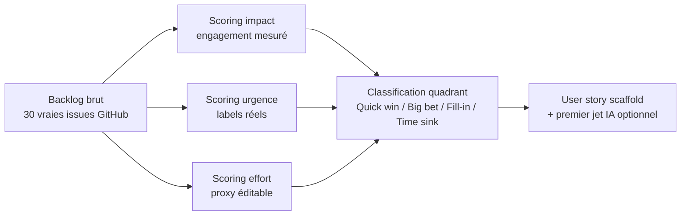

# Backlog Triage Express — POC

⚠️ **Projet personnel (PoC)**, démonstration de méthode. Données **réelles et publiques** : 30 vraies demandes d'évolution ouvertes du dépôt open-source [streamlit/streamlit](https://github.com/streamlit/streamlit) (label `type:enhancement`), récupérées via l'API publique GitHub (licence des données du dépôt : voir GitHub, contenu public). Aucun backlog client cité — le scénario est générique, inspiré de mon offre `Structuration de backlog produit`.

Je voulais illustrer ce sprint sur un vrai backlog non trié — pas un jeu de données inventé pour l'occasion — alors j'ai utilisé les vraies demandes d'évolution de l'outil même sur lequel tourne tout mon portfolio (Streamlit), un joli clin d'œil au passage.

## Ce que ça résout

Un Product Owner ou un dirigeant hérite d'un backlog en vrac — tickets non triés, priorité floue, formulés en langage libre plutôt qu'en user stories exploitables par une équipe. Ce sprint livre en 5 jours : un backlog réorganisé selon une grille impact/effort/urgence, une reformulation en user stories, une session de passation. Ce POC automatise la partie mécanique (scoring, classement, scaffold de reformulation), pour que la session de passation porte sur les vrais arbitrages, pas sur la mise en forme.

## Architecture



## Fonctionnalités

1. **Scoring impact** : basé sur l'engagement réel mesuré (réactions + commentaires), converti en score 1-5 par quantile du backlog chargé — pas des seuils absolus arbitraires, le classement reste pertinent quel que soit la taille/popularité du backlog.
2. **Scoring urgence** : basé sur des labels réels (confirmé/probable par les mainteneurs = urgent, explicitement écarté = pas urgent, friction quotidienne signalée = léger bonus).
3. **Scoring effort** : un **proxy de départ**, jamais un verdict — aucune heuristique ne peut mesurer la complexité technique réelle depuis un simple texte. Éditable ligne par ligne dans l'app avant toute décision (`st.data_editor`).
4. **Classification en quadrant** (Quick win / Big bet / Fill-in / Time sink) : matrice visuelle interactive.
5. **User story** : scaffold `En tant que ___, je veux [action], afin de ___` toujours disponible sans IA (ne prétend jamais deviner le rôle ou le bénéfice) ; premier jet automatique optionnel via Claude (BYOK, jamais stocké), à relire avant usage.

## Vérification

```bash
pip install -r requirements.txt
pytest tests/ -v          # 7 tests, logique vérifiée sur les 30 vraies issues GitHub
streamlit run app.py
```

Testé en local dans le navigateur (4 onglets, aucune erreur console) : sur ce backlog de démo précis, la matrice se concentre sur Quick win (12 items) et Fill-in (18 items) — aucun item ne dépasse le seuil "effort élevé" avec le proxy actuel, un résultat honnête plutôt qu'un résultat forcé pour "bien remplir" les 4 cases (voir `PROMPT_LOG.md`). Les 4 branches de classification sont bien couvertes par les tests unitaires (`test_classify_quadrant_all_four_cases`), indépendamment de ce que produit ce backlog précis.

## Stack

Python · Pandas (scoring, classement) · Streamlit (dont `st.data_editor`, `st.scatter_chart`) · Claude API (BYOK, optionnel, reformulation user story).

## Pour une mission réelle

Le backlog de démo devient le vrai backlog du client (upload CSV/JSON, colonnes documentées dans `DATA_DICTIONARY.md`). Le proxy d'effort se recalibre en une ligne si besoin (`src/backlog.py::score_effort_proxy`), et reste de toute façon éditable dans l'app — c'est justement l'objet de la session de passation, transmettre la logique, pas juste le résultat. Contact via [Sovereign Career](https://www.sovereigncareer.fr/freelance/freelance-consultant-data-steward-gisele-metouck).

---

Playbook complet (Définitions/Process/Documentation/Templates) : [`PLAYBOOK.md`](PLAYBOOK.md).
Construit avec l'IA, méthode documentée dans [`PROMPT_LOG.md`](PROMPT_LOG.md).
**Gisèle Metouck**, Consultante Business Analysis & Automation IA · [GitHub](https://github.com/Kingdmfncr)
